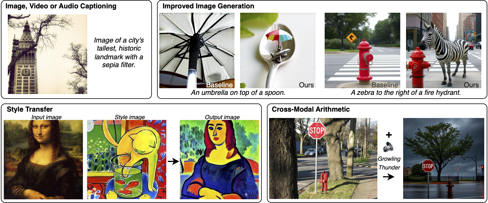

# LLMs can see and hear without any training

Official implementation of the paper **LLMs can see and hear without any training**.

[](https://arxiv.org/pdf/2501.18096.pdf)



## Installation

Install the conda environment using

```bash
conda env create -f environment.yml
conda activate MILS
```

## macOS Installation (Apple Silicon/Intel)

For macOS users, we recommend using Mambaforge instead of Conda for better dependency resolution:

1. Install Mambaforge:
```bash
# Using Homebrew
brew install micromamba

# Initialize micromamba
micromamba shell init --shell zsh --root-prefix ~/mamba
# Restart your terminal after this step
```

2. Create and activate the environment:
```bash
# Create the environment
mamba env create -f environment.yml

# Activate the environment
mamba activate MILS
```

3. Hugging Face Authentication:
```bash
# Install huggingface_hub if not already installed
pip install huggingface_hub

# Login to Hugging Face
huggingface-cli login

# Visit https://huggingface.co/meta-llama/Meta-Llama-3.1-8B-Instruct
# Accept the license agreement and wait for approval
```

Note: On macOS, CUDA is not available. The code will automatically run on CPU. For better performance, consider using a machine with NVIDIA GPUs.

## Dataset and checkpoints

Download the following datasets, annotations, and checkpoints

**MS-COCO**: Download the MS-COCO validation dataset from the official website [here](https://cocodataset.org/#download). Also, download the 5000 samples test split used in Karpathy et al., *Deep visual-semantic alignments for generating image descriptions*, CVPR 2015.

```bash
wget http://images.cocodataset.org/zips/val2014.zip
wget http://images.cocodataset.org/annotations/annotations_trainval2014.zip 

unzip val2014.zip
unzip annotations_trainval2014.zip
```

**Karpathy Split File**: For image captioning, you need the Karpathy split file that defines which images from COCO should be used for training, validation, and testing.

Option 1 - Download from Stanford:
```bash
wget https://cs.stanford.edu/people/karpathy/deepimagesent/caption_datasets.zip
unzip caption_datasets.zip
# Extract the dataset_coco.json file and rename it to 'split'
mkdir -p data/coco/test
cp dataset_coco.json data/coco/test/split
```

Option 2 - Download directly from the neuraltalk2 repository:
```bash
mkdir -p data/coco/test
wget https://raw.githubusercontent.com/karpathy/neuraltalk2/master/data/dataset_coco.json -O data/coco/test/split
```

**Clotho**: Download the clotho dataset from the official website [here](https://zenodo.org/records/3490684). We use the test split of this dataset for our benchmarking.

```bash
wget https://zenodo.org/records/3490684/files/clotho_audio_evaluation.7z
pip3 install dtrx
wget https://www.7-zip.org/a/7z2107-linux-x64.tar.xz
tar xf 7z2107-linux-x64.tar.xz
./7zz e clotho_audio_evaluation.7z
wget https://zenodo.org/records/3490684/files/clotho_captions_evaluation.csv

```

**MSR-VTT**: Download the dataset from [here](https://cove.thecvf.com/datasets/839). We use the test split of this dataset.

```bash
wget https://www.robots.ox.ac.uk/~maxbain/frozen-in-time/data/MSRVTT.zip
unzip MSRVTT.zip
```


**ViClip-InternVid-10M-FLT.pth**: Download from 
[here](https://huggingface.co/OpenGVLab/ViCLIP/blob/main/ViClip-InternVid-10M-FLT.pth) and set the correct path in `task_utils/video/viclip.py`.

## Updating the paths

Update the variables in [paths.py](paths.py) to set the dataset directory, and the output folder.

## Running the code

MILS is an inference-only method that can be run on a single A100 GPU. We run the experiments on eight A100 GPUs, and the code below can be adjusted for any number of GPUs.

### Image captioning

Generate captions using

```bash
CUDA_VISIBLE_DEVICES=0 python main_image_captioning.py --process 0 --num_processes 8 --batch_size 32 &
CUDA_VISIBLE_DEVICES=1 python main_image_captioning.py --process 1 --num_processes 8 --batch_size 32 &
CUDA_VISIBLE_DEVICES=2 python main_image_captioning.py --process 2 --num_processes 8 --batch_size 32 &
CUDA_VISIBLE_DEVICES=3 python main_image_captioning.py --process 3 --num_processes 8 --batch_size 32 &
CUDA_VISIBLE_DEVICES=4 python main_image_captioning.py --process 4 --num_processes 8 --batch_size 32 &
CUDA_VISIBLE_DEVICES=5 python main_image_captioning.py --process 5 --num_processes 8 --batch_size 32 &
CUDA_VISIBLE_DEVICES=6 python main_image_captioning.py --process 6 --num_processes 8 --batch_size 32 &
CUDA_VISIBLE_DEVICES=7 python main_image_captioning.py --process 7 --num_processes 8 --batch_size 32 &
```

The captions are saved in `OUTPUT_DIR`. Specify this path in `ours_result_path` variable in `eval/image_captioning.py` and then obtain captioning metrics as

```bash
python eval/image_captioning.py
```

#### Quick Testing with Limited Resources

For quick testing with minimal resources, use:

```bash
python main_image_captioning.py --ablation --num_processes 1 --process 0 --batch_size 4 --keep_previous 5 --requested_number 5 --iterations 2 --max_images 1 --force_process
```

This will:
- Process just 1 image (`--max_images 1`)
- Run on CPU
- Use a reduced number of iterations and candidates
- Force processing even if output already exists (`--force_process`)

#### Script Versions

There are three main versions of the image captioning script:

1. **main_image_captioning.py** - The modified version with Apple Silicon support that runs on CPU. This version includes the `--max_images` and `--force_process` flags for easier experimentation.

2. **main_image_captioning_original_version.py** - The original unmodified script from the MILS repository, which assumes CUDA availability.

3. **main_image_captioning_gpu.py** - An enhanced version that automatically detects and uses the best available device (MPS for Apple Silicon, CUDA for NVIDIA GPUs, or CPU as fallback). This version also includes the extra flags for convenience.

For GPU acceleration with a small model:

```bash
python main_image_captioning_gpu.py --ablation --num_processes 1 --process 0 --batch_size 4 --keep_previous 5 --requested_number 5 --iterations 2 --text_model facebook/opt-125m --clip_model RN50 --pretrained openai --max_images 10 --force_process
```

#### Captioning a single image

For testing with a single image without requiring the Karpathy split, you can use the `caption_single_image.py` script:

```bash
python caption_single_image.py --image_path /path/to/your/image.jpg
```

This script uses the same models and optimization process but works with any image without needing dataset splits.

### Audio captioning

Generate captions using

```bash
CUDA_VISIBLE_DEVICES=0 python main_audio_captioning.py --process 0 --num_processes 8 --batch_size 32 &
CUDA_VISIBLE_DEVICES=1 python main_audio_captioning.py --process 1 --num_processes 8 --batch_size 32 &
CUDA_VISIBLE_DEVICES=2 python main_audio_captioning.py --process 2 --num_processes 8 --batch_size 32 &
CUDA_VISIBLE_DEVICES=3 python main_audio_captioning.py --process 3 --num_processes 8 --batch_size 32 &
CUDA_VISIBLE_DEVICES=4 python main_audio_captioning.py --process 4 --num_processes 8 --batch_size 32 &
CUDA_VISIBLE_DEVICES=5 python main_audio_captioning.py --process 5 --num_processes 8 --batch_size 32 &
CUDA_VISIBLE_DEVICES=6 python main_audio_captioning.py --process 6 --num_processes 8 --batch_size 32 &
CUDA_VISIBLE_DEVICES=7 python main_audio_captioning.py --process 7 --num_processes 8 --batch_size 32 &
```

The captions are saved in `OUTPUT_DIR`. Specify this path in `address` variable in `eval/audio_captioning.py` and then obtain captioning metrics as

```bash
python eval/audio_captioning.py
```

### Video captioning

Generate captions using

```bash
CUDA_VISIBLE_DEVICES=0 python main_video_captioning.py --process 0 --num_processes 8 --batch_size 8 &
CUDA_VISIBLE_DEVICES=1 python main_video_captioning.py --process 1 --num_processes 8 --batch_size 8 &
CUDA_VISIBLE_DEVICES=2 python main_video_captioning.py --process 2 --num_processes 8 --batch_size 8 &
CUDA_VISIBLE_DEVICES=3 python main_video_captioning.py --process 3 --num_processes 8 --batch_size 8 &
CUDA_VISIBLE_DEVICES=4 python main_video_captioning.py --process 4 --num_processes 8 --batch_size 8 &
CUDA_VISIBLE_DEVICES=5 python main_video_captioning.py --process 5 --num_processes 8 --batch_size 8 &
CUDA_VISIBLE_DEVICES=6 python main_video_captioning.py --process 6 --num_processes 8 --batch_size 8 &
CUDA_VISIBLE_DEVICES=7 python main_video_captioning.py --process 7 --num_processes 8 --batch_size 8 &
```

The captions are saved in `OUTPUT_DIR`. Specify this path in `ours_result_path` variable in `eval/video_captioning.py` and then obtain captioning metrics as

```bash
python eval/video_captioning.py
```

### High-quality image generation

Generate high-quality image using

```bash
CUDA_VISIBLE_DEVICES=0 python main_image_generation_enhancement.py --process 0 --num_processes 8 --batch_size 4 &
CUDA_VISIBLE_DEVICES=1 python main_image_generation_enhancement.py --process 1 --num_processes 8 --batch_size 4 &
CUDA_VISIBLE_DEVICES=2 python main_image_generation_enhancement.py --process 2 --num_processes 8 --batch_size 4 &
CUDA_VISIBLE_DEVICES=3 python main_image_generation_enhancement.py --process 3 --num_processes 8 --batch_size 4 &
CUDA_VISIBLE_DEVICES=4 python main_image_generation_enhancement.py --process 4 --num_processes 8 --batch_size 4 &
CUDA_VISIBLE_DEVICES=5 python main_image_generation_enhancement.py --process 5 --num_processes 8 --batch_size 4 &
CUDA_VISIBLE_DEVICES=6 python main_image_generation_enhancement.py --process 6 --num_processes 8 --batch_size 4 &
CUDA_VISIBLE_DEVICES=7 python main_image_generation_enhancement.py --process 7 --num_processes 8 --batch_size 4 &
```

The image generations are saved in `OUTPUT_DIR`.

### Style transfer

Put the style and content image in the `images/` folder, and run 

```bash
python main_style_transfer.py --style_image <style_image> --content_image <content_image>
```

The output is saved in `OUTPUT_DIR`.

### Cross-modal arithmetic

We first use image captioning to convert image to text. Also, we use audio captioning to convert audio to text. Next, we combine the captions into an image generation prompt from the LLM, please see the paper for exact prompt details. The prompt is then fed to the high-quality image generation using `CustomArithmetic.csv` as the initial prompt.

## Issues

Please open an issue in this repository (preferred for better visibility) or reach out to [kumar.ashutosh@utexas.edu](mailto:kumar.ashutosh@utexas.edu).

## Contributing

See the [CONTRIBUTING](CONTRIBUTING.md) file for how to help out.

## License

`MILS` is made available under a [CC-by-NC 4.0 license](LICENSE.md), however third party content pulled from other locations are subject to their own licenses and you may have other legal obligations or restrictions that govern your use of that content.

## Cite

If you use this work, please cite:

```bibtex
@article{ashutosh2025llms,
  title={LLMs can see and hear without any training},
  author={Ashutosh, Kumar and Gandelsman, Yossi and Chen, Xinlei and Misra, Ishan and Girdhar, Rohit},
  journal={arXiv preprint arXiv:2501.18096},
  year={2025}
}
```

